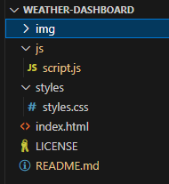
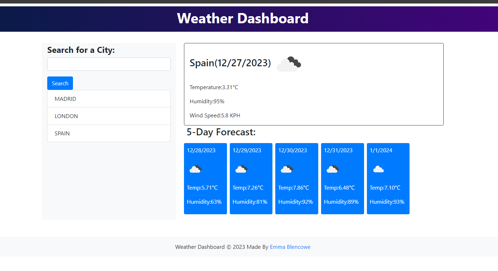

# Weather Dashboard

## Description

This project was a challenge to learn how to use API keys and create a weather Dashboard where you can look up and city and the next few days of its weather.

## Installation

To edit the code, clone the repo.

File Structure:

## Usage

Type the name of the city you want to see the weather for into the search box. Click search to see results.

Deployed Application:

Weather Dashboard:

## Credits

With help from Rockey Willemse.

## Resourses Used

Date format method:
https://developer.mozilla.org/en-US/docs/Web/JavaScript/Reference/Global_Objects/Date
https://www.freecodecamp.org/news/javascript-date-format-how-to-format-a-date-in-js/

How to use API keys:
https://coding-boot-camp.github.io/full-stack/apis/how-to-use-api-keys

Weather API:
https://openweathermap.org/api

A tutorial for the Open Weather API: 
http://osp123.github.io/tutorials/html/weatherAPI.html 

jQuery API Documentation:
https://api.jquery.com/

W3Schools: 
https://www.w3schools.com/js/default.asp

MDN Web Doc:
https://developer.mozilla.org/en-US/docs/Web/JavaScript

Bootstrap 5: 
https://getbootstrap.com/

## License

MIT license
